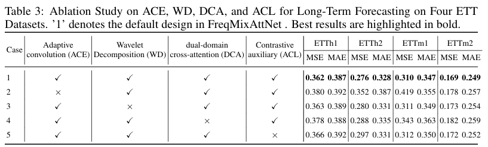

---
>
> 🙋 Please let us know if you find out a mistake or have any suggestions!
> 
> 🌟 If you find this resource helpful, please consider to star this repository:

## Introduction
🏆 **FreqMixAttNet**, a novel crossdomain forecasting framework that unifies time and frequency representations via a domain-mixing attention mechanism.**.

🌟**** 


## Get Started

1. Install requirements. ```pip install -r requirements.txt```
    > If you are using **Python 3.8**, please change the `sktime` version in `requirements.txt` to `0.29.1`
2. Download data. You can download all datasets from [Google Driver](https://drive.google.com/u/0/uc?id=1NF7VEefXCmXuWNbnNe858WvQAkJ_7wuP&export=download), [Baidu Driver](https://pan.baidu.com/share/init?surl=r3KhGd0Q9PJIUZdfEYoymg&pwd=i9iy) or [Kaggle Datasets](https://www.kaggle.com/datasets/wentixiaogege/time-series-dataset). **All the datasets are well pre-processed** and can be used easily.
3. Train the model. We provide the experiment scripts of all benchmarks under the folder `./scripts`. You can reproduce the experiment results by:

```bash
bash ./scripts/etth1/etth1_96.sh
bash ......
```

## Main Results
We conduct extensive experiments to evaluate the performance and efficiency of FreqMixAttNet, covering long-term forecasting, including 6 real-world benchmarks and 9 baselines.
**🏆 FreqMixAttNet achieves consistent state-of-the-art performance in all benchmarks**, covering a large variety of series with different frequencies, variate numbers and real-world scenarios.

### Long-term Forecasting

To facilitate comparison, we evaluate multiple forecast horizons with a fixed input sequence length of 96 for long-term forecasting. Detailed settings are provided in Appendix A.1. Table 2 summarizes the forecasting performance across all datasets and baselines. Compared with strong baselines in the frequency domain (SimpleTM Chen et al. (2025)) and the time domain (CATS Lu et al. (2024)), both of which employ complex Transformer architectures, our proposed model FreqMixAttention achieves superior performance. Compared with TimeMixer Wang et al. (2024a) and ATFNet Ye & Gao (2024), our model delivers better results, suggesting that multi-scale trend–season decomposition alone or modeling the time and frequency domains separately without interaction is insufficient. FreqMixAttention attains the best results on most forecast horizons (**17/24 for MSE and 20/24 for MAE**). These findings highlight that integrating both domains is essential for capturing underlying patterns in diverse time series data.

<p align="center">

</p>


## Model Abalations

To verify the effectiveness of each component of FreqMixAttNet, we provide the detailed ablation study on every possible design to evaluate four key architectural components: Adaptive Convolution Embedding (ACE), Wavelet Decomposition (WD), Dual-domain Cross Attention
(DCA), and the Auxiliary Contrastive Loss (ACL). Table 3 summarizes the results on four ETT datasets, where each component is removed individually under the 96-step prediction horizon. Removing ACE and DCA leads to significant performance degradation, while WD provides slight improvements. The ACL also contributes marginally more than WD. （see our paper for full results 😊）.

<p align="center">

</p>


## Further Reading

**Authors**: 

```bibtex


```

## Acknowledgement

We appreciate the following GitHub repos a lot for their valuable code and efforts.
- Time-Series-Library (https://github.com/thuml/Time-Series-Library)
- Autoformer (https://github.com/thuml/Autoformer)
- TimeMixer (https://github.com/kwuking/TimeMixer)

## Contact

If you have any questions or want to use the code, feel free to contact:

